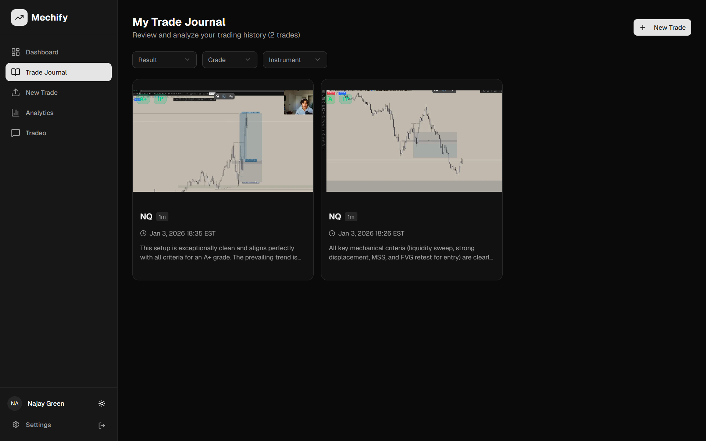
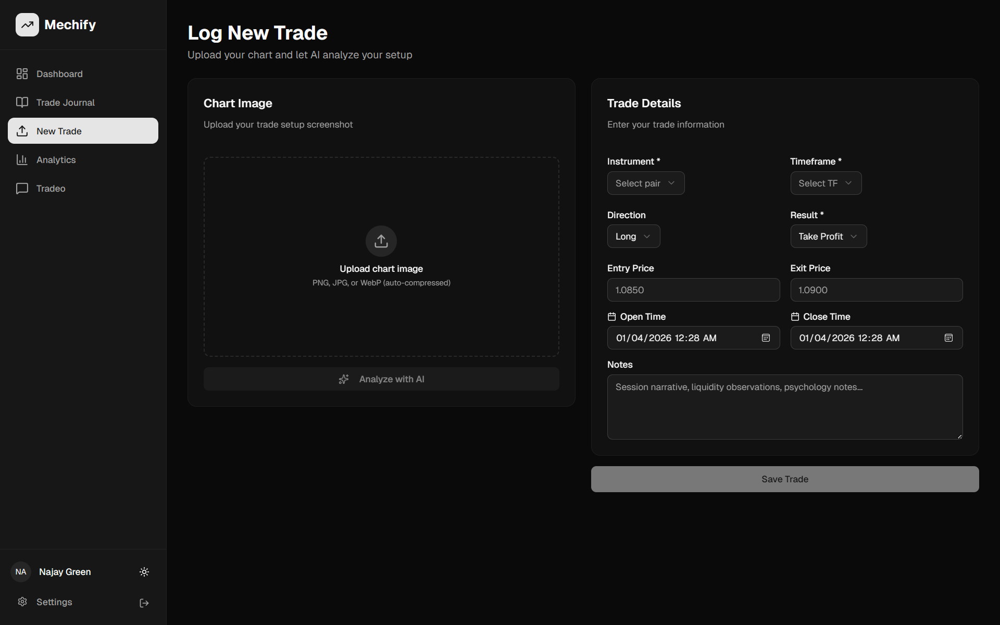

# Mechify - AI-Powered Trading Journal

<p align="center">
  
</p>

<p align="center">
  <strong>Master Your Trading with AI-Powered Journaling</strong>
</p>

<p align="center">
  Track your trades, analyze your charts with AI vision, and get personalized feedback to improve your trading performance.
</p>

---

## 📸 Screenshots

### Dashboard
<!-- Add your dashboard screenshot here -->


### Trade Journal
<!-- Add your trade journal screenshot here -->


### AI Chart Analysis
<!-- Add your AI analysis screenshot here -->


### Trade Entry Form
<!-- Add your trade form screenshot here -->


### Analytics
<!-- Add your analytics screenshot here -->


### Settings
<!-- Add your settings screenshot here -->


---

## ✨ Features

### 📊 Smart Trade Journaling
- Upload chart screenshots for each trade
- Log trade details including instrument, timeframe, entry/exit prices
- Track trade results (Take Profit, Stopped Out, Break Even)
- Add personal notes and observations

### 🤖 AI-Powered Chart Analysis
- Automatic chart analysis using Google Gemini Vision AI
- Identifies key technical patterns and confluence factors
- Grades setups from A+ to C based on technical criteria
- Provides reasoning and confidence levels for each analysis

### 📈 Performance Analytics
- Win rate tracking and statistics
- Grade distribution charts
- Result distribution visualization
- Session performance breakdown (London, New York, Asian)
- Weekly trade count tracking

### 💬 AI Trading Mentor (Tradeo)
- Chat with an AI trained on trading principles
- Get real-time feedback on your setups
- Ask questions about trading psychology and execution
- Contextual advice based on your trade history

### ⚙️ Customizable Settings
- Timezone selection (80+ global timezones)
- Profile customization
- Theme toggle (Dark/Light mode)
- Notification preferences

### 🔒 Secure & Private
- Supabase authentication
- Row-level security for all data
- Encrypted image storage
- Your data is never shared

---

## 🛠️ Tech Stack

- **Framework:** Next.js 15 (App Router)
- **Language:** TypeScript
- **Styling:** Tailwind CSS
- **UI Components:** shadcn/ui
- **Database:** Supabase (PostgreSQL)
- **Authentication:** Supabase Auth
- **Storage:** Supabase Storage
- **AI:** Google Gemini 2.5 Flash (Vision API)
- **Charts:** Recharts

---

## 🚀 Getting Started

### Prerequisites
- Node.js 18+
- npm or yarn
- Supabase account
- Google Gemini API key

### Installation

1. **Clone the repository**
   ```bash
   git clone https://github.com/yourusername/mechify.git
   cd mechify
   ```

2. **Install dependencies**
   ```bash
   npm install
   ```

3. **Set up environment variables**
   ```bash
   cp .env.example .env
   ```
   
   Fill in your environment variables:
   ```env
   NEXT_PUBLIC_SUPABASE_URL=your_supabase_url
   NEXT_PUBLIC_SUPABASE_ANON_KEY=your_supabase_anon_key
   GEMINI_API_KEY=your_gemini_api_key
   ```

4. **Set up Supabase**
   - Create a new Supabase project
   - Run the migrations in `supabase/migrations/` folder
   - Create a storage bucket named `trade-screenshots` (public)

5. **Run the development server**
   ```bash
   npm run dev
   ```

6. **Open your browser**
   Navigate to [http://localhost:3000](http://localhost:3000)

---

## 📁 Project Structure

```
mechify/
├── src/
│   ├── app/                 # Next.js App Router pages
│   │   ├── (auth)/          # Authentication pages
│   │   ├── dashboard/       # Dashboard & feature pages
│   │   └── actions.ts       # Server actions
│   ├── components/          # React components
│   │   ├── ui/              # shadcn/ui components
│   │   ├── dashboard/       # Dashboard components
│   │   ├── trade-view/      # Trade-related components
│   │   └── chat/            # Chat interface
│   ├── lib/                 # Utilities & configurations
│   └── types/               # TypeScript types
├── supabase/
│   └── migrations/          # Database migrations
└── public/                  # Static assets
```

---

## 📝 License

This project is for personal use.

---

## 🙏 Acknowledgments

- [Next.js](https://nextjs.org/)
- [Supabase](https://supabase.com/)
- [shadcn/ui](https://ui.shadcn.com/)
- [Google Gemini](https://ai.google.dev/)
- [Tailwind CSS](https://tailwindcss.com/)
