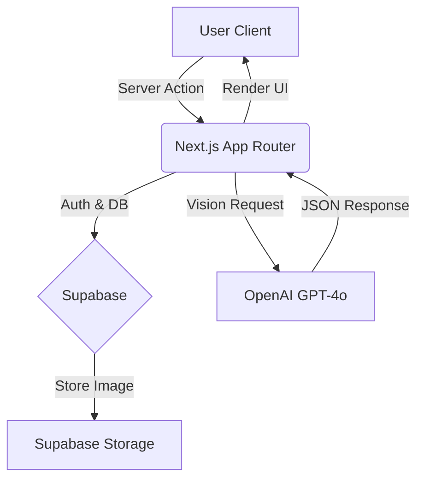

# Mechify — Project Requirements & Architecture

> A smart trade journaling app with AI-powered chart analysis and personalized trading guidance.
> **Philosophy:** Clean, simple, and mechanical.

---

## 1. Core Features

### 🔐 Authentication & User Management
* **Provider:** Supabase Auth.
* **Methods:** Email/Password (MVP), Google/Discord OAuth (Phase 2).
* **Security:** Row Level Security (RLS) policies to ensure users only access their own journals.

### 📝 Trade Upload & Logging
* **Image Handling:**
    * User uploads chart image.
    * **Optimization (Crucial):** Client-side compression (max 1024px width, WebP format) *before* upload to save bandwidth/storage costs.
* **Data Schema:**
    * **Instrument:** (EURUSD, NQ, BTC, Gold, etc.)
    * **Timeframe:** (1m, 5m, 15m, 1h, 4h, D)
    * **Time Handling:**
        * **Storage:** Always store as **UTC** (Zulu time).
        * **Display:** Convert to **EST (-0500)** or user local time on the client-side.
    * **Result:** `Break Even | Take Profit | Stopped Out`
    * **Narrative:** Manual notes input.

### 🧠 AI Image Analysis (Human-in-the-Loop)
* **Process:** AI analyzes the compressed image using GPT-4o Vision.
* **Output:** JSON structured data (not just text).
* **Editable Fields:** AI populates the fields, but the **User can edit** the analysis if the AI "hallucinates" a setup.
* **Key Metrics Detected:**
    * Setup Score (A-, A, A+)
    * Liquidity Sweeps (Buy-side/Sell-side)
    * FVG / Order Block usage
    * Estimated Entry Coordinate (x, y) for overlay.

### 🤖 Trade AI Buddy (Chat)
* **Context:** Chat interface embedded in the dashboard.
* **System Prompt:** Uses "Chain of Thought" reasoning based on the **PB Blake Mechanical Trading Model**.
* **Capabilities:** Streaming responses to specific trading questions (e.g., "Why was this a B- setup instead of A?").

### 📊 Trade Dashboard
* Displays all logged trades for the authenticated user
* Each trade shows: Image, timestamps, result, AI score, analysis, notes
* **Filters:** Timeframe, Result type, Instrument, Score (A-, A, A+)

### 📈 Data Tracking
* **Basic Stats:** Win rate, Total trades, Grade distribution, Average duration, Session performance
* **Phase 2:** Equity curve chart

---

## 2. Optimized Tech Stack

### **Architecture Overview**

> **Design Principle:** Use Next.js Server Actions to minimize "glue code" and API endpoints.



### **Stack Components**

| Layer | Technology | Implementation Detail |
|-------|------------|----------------------|
| **Framework** | Next.js 14+ | App Router, Server Actions for mutations (no manual API routes) |
| **UI Library** | Shadcn/ui | TailwindCSS based. Accessible, copy-paste components |
| **Database** | Supabase | PostgreSQL. Relational data for trades and users |
| **Auth** | Supabase Auth | Native integration with Next.js middleware |
| **AI Vision** | GPT-4o | Vision capability for charts. Returns JSON |
| **Deployment** | Vercel | Edge functions for low latency |

---

## 3. Data Flow & AI Implementation

### AI Analysis Workflow

1. **Upload:** User selects image → Browser resizes/converts to WebP
2. **Server Action:** Image sent to OpenAI with specific System Prompt
3. **Response:** OpenAI returns a JSON Object (strictly enforced)
4. **Save:** Next.js saves the JSON result + Image URL to Supabase DB
5. **Render:** UI displays the form pre-filled with AI data for user review

### Prompt Strategy (Clean Code)

> Do not ask for paragraphs. Ask for structured data to keep the frontend clean.

**Target JSON Output:**

```json
{
  "market_bias": "bearish",
  "confluence_factors": [
    "Asian Low Swept",
    "Mitigated 15m Bearish OB"
  ],
  "setup_grade": "A",
  "entry_coordinate": { "x": 45, "y": 30 },
  "reasoning": "Price cleared liquidity and displaced lower..."
}
```

---

## 4. Project File Structure (Feature-Based)

> Grouping by feature (Clean Code) rather than file type makes it easier to scale.

```
src/
├── app/
│   ├── (auth)/             # Login/Signup pages
│   ├── dashboard/
│   │   ├── journaling/     # Trade upload & form
│   │   ├── analysis/       # AI chat & stats
│   │   └── page.tsx        # Main dashboard view
│   ├── actions.ts          # Server Actions (uploadTrade, analyzeImage)
│   └── layout.tsx
├── components/
│   ├── ui/                 # Shadcn primitives (buttons, inputs)
│   └── trade-view/         # Trade specific components (ChartOverlay, GradeBadge)
├── lib/
│   ├── supabase/           # Client instantiation
│   └── ai-prompting.ts     # System prompts & OpenAI config
└── types/
    └── trade.ts            # TypeScript interfaces for Database & AI JSON
```

---

## 5. MVP Checklist

### Phase 1: The Core Loop (Journaling)

- [ ] **Setup:** Next.js repo with Supabase + Shadcn configured
- [ ] **DB Schema:** `profiles` table and `trades` table created
- [ ] **Upload:** Drag-and-drop zone with client-side compression
- [ ] **Vision:** Server Action that sends image to GPT-4o and logs the raw JSON response
- [ ] **Display:** Trade card showing the Image + AI Grade + User Notes

### Phase 2: The Logic (Optimization)

- [ ] **Timezones:** Implement `date-fns` to format UTC dates to user's local time
- [ ] **Chat:** Add the sidebar chat interface with context awareness
- [ ] **Stats:** Simple "Win Rate" and "Grade Distribution" cards

---

## 6. Getting Started

```bash
# 1. Initialize Next.js with TS and Tailwind
npx create-next-app@latest mechify --typescript --tailwind --eslint --app

# 2. Add the UI library (Shadcn)
npx shadcn-ui@latest init

# 3. Add core dependencies
npm install @supabase/supabase-js openai lucide-react date-fns

# 4. Setup env variables
# .env.local
# NEXT_PUBLIC_SUPABASE_URL=...
# NEXT_PUBLIC_SUPABASE_ANON_KEY=...
# OPENAI_API_KEY=...
```

---

*Last updated: January 2026*
